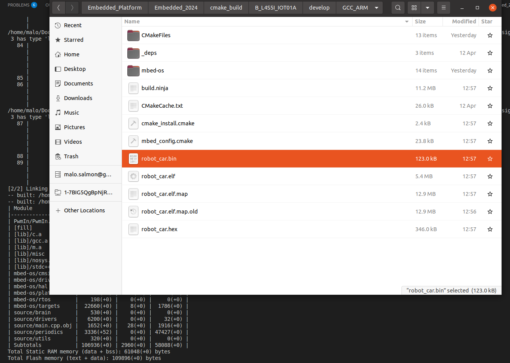

# Embedded Platform

Starter code from https://github.com/ECC-BFMC/Embedded_Platform

## Resources used

These files use the mbed.h platform which is developed by ARM. It enables us to develop at a high level in C++, then compile the code for it to go on a microcontroller. The mbed.h libraries take care of translating all that was written in C++ and making it work for a specific board. An example of this is given in step 4 of the build process. While most of the available resources of the board are available, some functionalities such as the DMA cannot be used. To see what can and cannot be used, refer to https://os.mbed.com/docs/mbed-os/v6.16/introduction/index.html

## Package overview

The main.cpp file is a fake RTOS implementation. You can add tasks to a scheduler, which runs them one after another. Each task has a specified rate at which it runs (e.g. every 10 ms). However, this is not a true RTOS implementation and there is no priority to the tasks. They simply run one after another. If you want to add another task, you need to declare it following the structure of the tasks that are currently there and add it to the tasklist.

## Specific Task Overview

The following sections will give a brief overview of what every task does.

### IMU

Reads data from the Bosch BN055 IMU board over I2C. Then prints the data over serial.

### Encoder

Reads the data from the AMS AS5048A encoder over PWM. Then attempts to filter that data to get a stable angle value from which the speed is computed. A butterworth filter is applied in an attempt to reduce noise. Still needs work.

### Robot State Machine

This task is responsible for listening to commands over serial. If it receives a command, it executes the callback associated to this command.

### Steering Motor

This task is responsible for steering the servo on the car. Custom calibration of the steering angles was done. It uses a second order equation to calculate the PWM that needs to be sent to the servo to achieve the correct steering angle. An attempt to create a PID that takes into account the IMU's yaw to calibrate the precise steering was made. However, it was never fully implemented.

### Speeding Driver

Computes the PWM value that needs to be sent to the car to achieve a given speed. Calibration of the output PWM based on the distance travelled was done, but this calibration was also a function of the input voltage to the car. It therefore needs to be redone.

## Development Pipeline

The basic steps to build and compile are outlined in the build section. When developing, you should `cd` to the `Embedded_2024` folder, and run the command in step 4. Then, in your computer's file explorer, go to `Embedded_2024/cmake_build/B_L4S5I_IOT01A/develop/GCC_ARM`. There you should see a file called `robot_car.bin`.



Connect the STM32 to your computer. It should appear in the file explorer. Open the directory, and drag and drop the `robot_car.bin` file into the STM32. You should see the STM reset. And there you go, you've just flashed the STM with your code!

### Communicating over serial

To communicate over serial with the STM32 over serial and see what data is being printed, you can install minicom in your terminal (Ubuntu) or use PuTTY (Windows). The default configuration for the serial port is the following:

- **Baud rate:** 115200 bps  
- **Data bits:** 8  
- **Parity:** No  
- **Stop bits:** 1  

You should check which port the STM connects to by default by using `ls /dev/tty*` or something like that.

## Build process

(Requirements: [Python 3.6+](https://www.python.org/downloads/), [CMake 3.19.0+](https://cmake.org/download/))

1. **Install Ninja and Mbed-tools:**  
   ```sh
   pip install ninja
   pip install mbed-tools

```

2. **Install cross-compiler**
 from https://developer.arm.com/downloads/-/gnu-rm

3. **Fetch Mbed library:**
```sh
mbed-tools deploy
```

4. **Build and Compile**
[Build and compile](https://os.mbed.com/docs/mbed-os/v6.16/build-tools/use.html):
```sh
mbed-tools compile -m B_L4S5I_IOT01A -t GCC_ARM
```

5- **Flash the code on the board:**
Copy cmake_build/B_L4S5I_IOT01A/develop/GCC_ARM/robot_car.bin into your stm board
