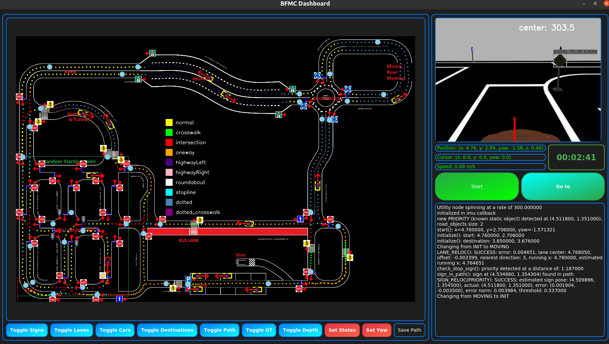

# AD: Autonomous Driving Pipeline

**Autonomous Driving Pipeline for the Bosch Future Mobility Challenge**  
[Official Challenge Website](https://boschfuturemobility.com/)

---

## 🏎️ Description

This repository contains the Autonomous Driving (AD) pipeline developed for the Bosch Future Mobility Challenge. Designed for a 1:10 scale autonomous vehicle, the project includes core modules for:

- **Perception**: Object detection and lane recognition using deep learning.
- **Localization**: Sensor fusion with Extended Kalman Filtering (EKF).
- **Planning**: Path optimization and decision-making.
- **Control**: Model Predictive Control (MPC) for smooth trajectory execution.

Built on **ROS (Robot Operating System)**, the pipeline supports both **simulation (Gazebo)** and real-world deployment, leveraging an **STM32-based embedded platform** for low-level control.

---

## 🏗️ Project Structure

- **Embedded_Platform/** - Interfaces with STM32 for motor, servo, and sensor control.
- **src/** - Contains the main modules:
  - **control/** - Implements Model Predictive Control (MPC) and state machine logic.
  - **localization/** - Fuses sensor data using an Extended Kalman Filter (EKF).
  - **perception/** - Uses deep learning models for object detection and lane recognition.
  - **planning/** - Generates optimized paths from global waypoints.
  - **gui/** - Provides visualization and manual control using PyQt5.
  - **utils/** - Defines custom ROS messages and services used by other packages.

Each of these modules is described in detail below, with figures where applicable.

---

## 🔍 Detailed Package Overview

### 🖥️ Embedded Platform
This package contains firmware modified from Bosch’s provided code to interface with the **STM32 microcontroller**, controlling the vehicle’s **motor, servo, and sensors** (e.g., IMU, camera, encoders).

### 🏎️ Control
- Uses **Model Predictive Control (MPC)** for smooth trajectory tracking.
- Implements a **finite state machine** for handling autonomous behaviors.


### 🌍 Localization
- Employs the `robot_localization` package to integrate GPS, IMU, and odometry data using an **Extended Kalman Filter (EKF)**.
- Simulated GPS delay and noise are added for realism in **Gazebo**.

### 👀 Perception
- **Lane Detection**: Uses a **histogram-based** approach.
- **Sign Detection**:
  - **YOLOFastestV2 using NCNN (CPU inference)** or **YOLOv8 using TensorRT (GPU inference)** for real-time inference.
  - Detects competition-relevant **traffic signs, traffic lights (with color classification), vehicles, and pedestrian dolls**.

### 🛤️ Planning
- Loads **global waypoints** from a **GraphML file**.
- Plans optimal path that goes through all desired destination points.
- Uses **spline interpolation** to generate a smooth, drivable path.

### 📊 GUI
- Built with **PyQt5** for real-time visualization of:
  - Camera feed
  - Vehicle state estimation
  - Planned paths and detected objects
- Provides manual override for:
  - **Start/stop controls**
  - **Path re-planning**
  - **Object toggling**



---

## 📦 Dependencies

### 🐧 Ubuntu 20.04
- Recommended OS. Not sure if ROS Noetic compatible with other versions.

### 🔧 ROS Installation
- Follow the [ROS Installation Guide](http://www.autolabor.com.cn/book/ROSTutorials/chapter1/12-roskai-fa-gong-ju-an-zhuang/124-an-zhuang-ros.html).

### 🏁 Simulation Platform
- Install the [Gazebo-based simulator](https://github.com/simonli357/Simulator).

### 📷 OpenCV (4.6.0+)
- Install using [this guide](https://docs.opencv.org/4.x/d7/d9f/tutorial_linux_install.html) with `opencv_contrib`.
- Build `cv_bridge`:
  ```bash
  catkin_make -DOpenCV_DIR=/path/to/opencv-4.9.0/build
  ```

### 📦 Required Python Libraries
- Install dependencies:
  ```bash
  pip install -r ~/AD/requirements.txt
  ```

### 🛰️ Robot Localization
- Install:
  ```bash
  sudo apt update && sudo apt install ros-noetic-robot-localization
  ```

### ⚡ NCNN for YOLO Deployment
- Follow [this NCNN build guide](https://github.com/Tencent/ncnn/wiki/how-to-build).

### 🚀 TensorRT for GPU Inference
- Follow `Cuda&TrtInstall.md` instructions for installation.
- Add paths to `CMakeLists.txt`:
  ```bash
  include_directories(/home/{user}/TensorRT-8.6.1.6/include)
  link_directories(/home/{user}/TensorRT-8.6.1.6/lib)
  ```

### 🎥 Intel RealSense
- Install using [this guide](https://github.com/IntelRealSense/librealsense).
  ```bash
  sudo apt-get update && sudo apt-get install autoconf libudev-dev
  ```

### 📏 Acados for Optimization
- Follow [Acados installation steps](https://github.com/acados/acados) to install dependencies.
- Configure:
  ```bash
  echo 'export ACADOS_SOURCE_DIR="/home/{user}/acados"' >> ~/.bashrc
  ```

---

## 🔨 Build Instructions

1. Build the packages:
  ```bash
  catkin_make --pkg utils
  catkin_make
  ```

---

## 🚀 Usage

### Simulation

#### Start Simulation
- cd to where the simulator workspace is located.
```bash
source devel/setup.bash
roslaunch sim_pkg run3.launch
```

#### Run Path Planner Server
```bash
rosrun planning path2.py
```

#### Launch Camera Node
```bash
roslaunch perception cameraNode.launch newlane:=false use_tcp:=true ip:=127.0.0.1
```

#### Run Control Node
```bash
roslaunch control controller.launch sign:=true v:=25 use_tcp:=true ip:=127.0.0.1
```

#### Start GUI
```bash
rosrun gui gui2.py
```
Press **start** to follow the planned path. To change the path, **double-click on a destination** and press **goto**. 

### Real Vehicle Run

#### Run Path Planner Server
```bash
rosrun planning path2.py
```

#### Launch Camera Node
```bash
roslaunch perception cameraNode.launch newlane:=false real:=true realsense:=true use_tcp:=true ip:={ip_address}
```
- replace {ip_address} by ip address of computer on which the gui is run

#### Run Control Node
```bash
roslaunch control controller.launch sign:=true lane:=true v:=25 real:=true use_tcp:=true ip:={ip_address}
```
- replace {ip_address} by ip address of computer on which the gui is run

#### Start GUI
```bash
rosrun gui gui2.py
```
- run this on another computer to see what the car is doing.

